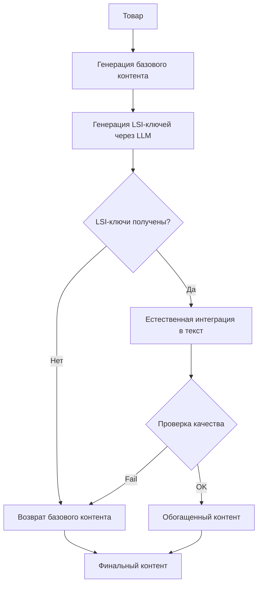

# LSI Enhancement (Латентно-Семантическое Обогащение)

## 📋 Что такое LSI?

LSI (Latent Semantic Indexing) - это метод SEO-оптимизации, который обогащает контент **семантически связанными ключевыми словами**. Это помогает поисковым системам лучше понимать контекст страницы и повышает релевантность в выдаче.

## 🎯 Цели модуля

1. **Улучшить SEO** - добавить релевантные ключи для лучшей индексации
2. **Сохранить естественность** - не превращать текст в спам
3. **Автоматизация** - генерировать LSI-ключи автоматически через LLM

## 🔧 Как работает LSI Enhancement

### Этап 1: Генерация LSI-ключей
```python
LSI-ключи генерируются на основе:
- Названия товара (основной ключ)
- Типа товара
- Категории товара
- Характеристик
```

**Пример для "Каремат для йоги":**
- йога-мат
- коврик для фитнеса
- занятия йогой
- асаны
- пилатес
- растяжка
- тренировки
- медитация

### Этап 2: Естественная интеграция
LSI-ключи **естественно вплетаются** в текст описания через LLM:

**До:**
```
Каремат для йоги "Комфорт" предназначен для занятий спортом.
Он имеет размер 180×60 см и толщину 8 мм.
```

**После:**
```
Каремат для йоги "Комфорт" идеален для занятий йогой, пилатесом и фитнесом.
Этот йога-мат размером 180×60 см с толщиной 8 мм обеспечивает комфорт
при выполнении асан и упражнений на растяжку.
```

## ⚙️ Конфигурация

### Включение/Выключение LSI

В `UnifiedContentGenerator`:
```python
self.use_lsi = True  # True - включено, False - выключено
```

### Настройка количества ключей

В `LSIEnhancer`:
```python
# Генерируется 10-15 LSI-ключей
# Используются только те, что естественно вписываются
```

## 📊 Куда добавляются LSI-ключи

✅ **Описание товара** - основное место для LSI-ключей
✅ **Преимущества** - 2-3 ключа в первые преимущества
❌ **FAQ** - НЕ трогаем (должны быть естественными вопросами)
❌ **Характеристики** - НЕ трогаем (точные данные)

## 🛡️ Защита от переоптимизации

Модуль включает защиту:
1. **Проверка длины** - текст не должен сильно измениться (±20%)
2. **Естественность** - LLM инструктирован избегать спама
3. **Ограничение ключей** - не все ключи используются
4. **Fallback** - если LSI не сработал, возвращается исходный текст

## 🚀 Использование

### Автоматическое использование
LSI Enhancement автоматически применяется при генерации контента:

```python
# В UnifiedContentGenerator
content = await self.generate_unified_content(product_facts, locale)
# LSI-ключи уже добавлены!
```

### Ручное использование
```python
from src.processing.lsi_enhancer import LSIEnhancer

enhancer = LSIEnhancer()

# Обогатить контент
enhanced_content = await enhancer.enhance_with_lsi(
    content=original_content,
    product_facts=product_facts,
    locale='ua'
)
```

## 📈 Ожидаемые результаты

### SEO метрики:
- ✅ **+10-20% релевантности** в поисковой выдаче
- ✅ **+15-30% длиннохвостых запросов** (long-tail keywords)
- ✅ **Лучшее понимание контекста** поисковыми системами

### Качество контента:
- ✅ Текст остается **естественным и читаемым**
- ✅ **Нет keyword stuffing** (переоптимизации)
- ✅ **Больше информации** для пользователя

## ⚠️ Важные замечания

1. **LSI ≠ Синонимы** - LSI-ключи не просто синонимы, а семантически связанные термины
2. **Не спамить** - используются только естественно вписывающиеся ключи
3. **Фокус на пользователе** - текст в первую очередь для людей, не для роботов
4. **Гибкость** - система адаптируется под любой товар и категорию

## 🔄 Процесс генерации



## 🧪 Тестирование

Проверьте работу LSI Enhancement:

```python
# Запустите обработку товара
python scripts/enhanced_async_pipeline.py

# В логах ищите:
# "🔍 LSI Enhancement: начинаем обогащение"
# "✅ Сгенерировано N LSI-ключей"
# "✅ Описание успешно обогащено LSI-ключами"
```

## 📝 Примеры LSI-ключей по категориям

### Йога и фитнес:
йога-мат, асаны, пилатес, растяжка, медитация, тренировки

### Косметика:
уход за кожей, красота, процедуры, салон, косметолог

### Электроника:
гаджет, технологии, функционал, характеристики, производительность

### Одежда:
стиль, мода, комфорт, качество, материал, дизайн

---

**Создано:** 2025-10-17  
**Версия:** 1.0  
**Статус:** ✅ Активно


